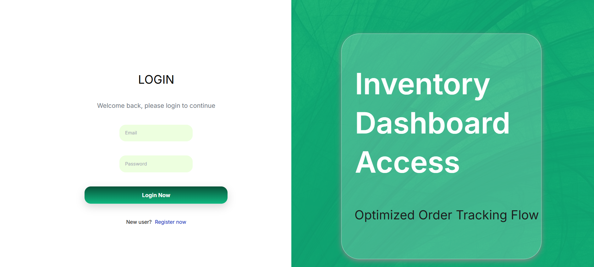
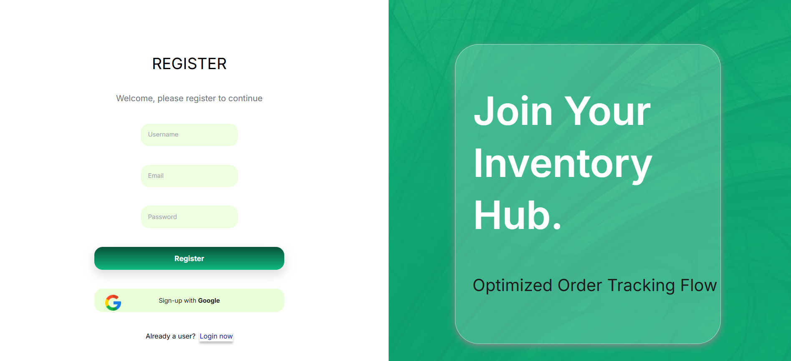
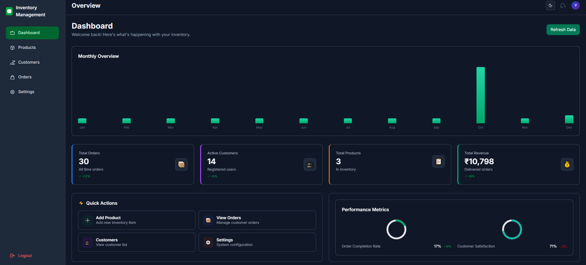
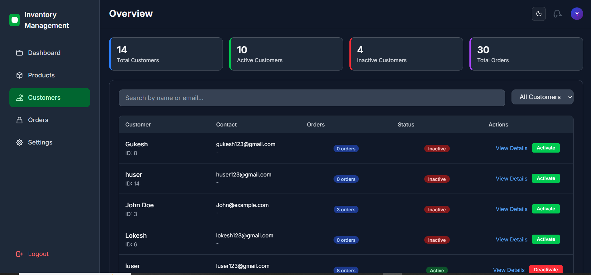
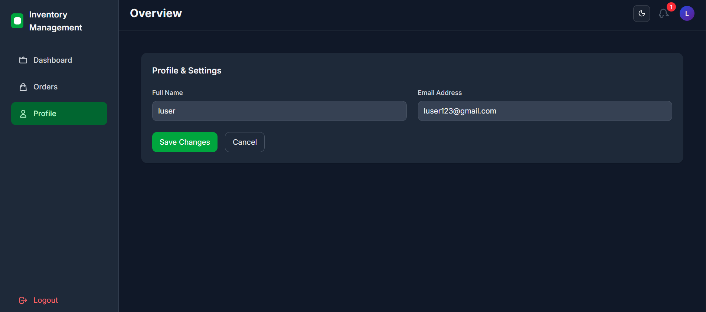

# Inventory Management System

A full-stack **Inventory Management System** built to manage products, customers, orders, and users efficiently. This project demonstrates real-world application development using modern web technologies and clean architecture.

---

## 🚀 Project Overview

The Inventory Management System helps businesses track inventory, manage customers and orders, and monitor stock levels through a clean and responsive user interface. The application follows a client-server architecture with RESTful APIs connecting the frontend and backend.

This project is actively maintained, and some advanced integrations are currently under development.

---

## 🛠️ Tech Stack

### Frontend

* React
* TypeScript
* Tailwind CSS
* Shadcn UI
* Redux Toolkit

### Backend

* Node.js
* Express.js

### Database

* PostgreSQL

---

## ✨ Features

* User authentication (Login & Register)
* Role-based user dashboards
* Product management (Add / Update / Delete)
* Customer management
* Order management
* Stock quantity tracking
* Responsive and modern UI
* Centralized state management using Redux Toolkit
* RESTful API architecture

---

## 🖼️ Screenshots

### Login



### Register



### Dashboard



### Products


### Orders


### Customers



### User Dashboard


### User Orders


### User Profile



### Settings


---

## 📁 Folder Structure

```
Inventory_Management_System/
│
├── frontend/          # React frontend
├── backend/           # Node.js backend
├── screenshots/       # Project screenshots
└── README.md
```

---

## ⚙️ How to Run the Project Locally

### Prerequisites

* Node.js (v18+ recommended)
* PostgreSQL
* npm

---

### 1️⃣ Clone the Repository

```bash
git clone https://github.com/your-username/inventory-management-system.git
cd inventory-management-system
```

---

### 2️⃣ Backend Setup

```bash
cd backend
npm install
npm start
```

Create a PostgreSQL database and update the database configuration in the `.env` file.

---

### 3️⃣ Frontend Setup

```bash
cd frontend
npm install
npm run dev
```

---

## 🔐 Environment Variables

Create a `.env` file inside the backend folder:

```env
DB_HOST=localhost
DB_USER=postgres
DB_PASSWORD=your_password
DB_NAME=inventory_db
DB_PORT=5432
```

---

## 🌐 Live Demo

Live demo is currently unavailable.

**Reason:**

* Google Sign-In (OAuth) integration is under development
* Payment Gateway integration is under development and requires production credentials

The application can be fully tested locally by following the setup steps above.

---

## 🚧 Work in Progress

The following features are currently under development:

* Google Sign-In (OAuth)
* Payment Gateway integration
* Improved role-based access control

---

## 📘 What I Learned from This Project

* Designing RESTful APIs using Node.js and Express
* Managing global state using Redux Toolkit
* PostgreSQL database schema design and relationships
* Building reusable UI components with React
* Structuring a scalable full-stack application
* Handling authentication and authorization flows

---

## 👨‍💻 Author

**Yashodeep Deshpande**
MCA Graduate | Full Stack Developer

---

## 📄 License

This project is created for learning and demonstration purposes.
